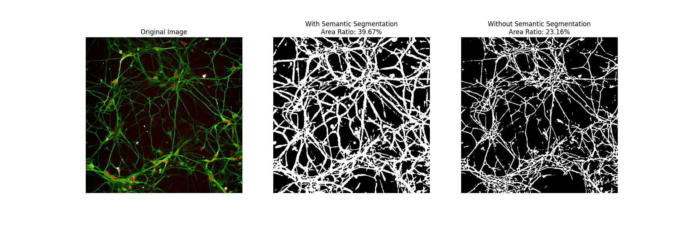

# Neurite Analysis

This code is designed to analyze various characteristics related to neurites, including neuron cell counting and neurite area analysis.

## Neuron Cell Counting
To count neuron cells, open the `cell_counting.ijm` script in ImageJ and run it. This will generate a table containing the number of cells in the image.

## Neurite Area Analysis
The neurite area analysis consists of two main steps:

### 1. Semantic Segmentation in ImageJ
- Open the `neurite_area_analysis.ijm` script in ImageJ and run it.
- You can load our pretrained model for semantic segmentation or use ImageJ's `Weka Trainable Segmentation` plugin to label the image manually.
- After segmentation, all images in your folder will be enhanced accordingly.

### 2. Quantitative Image Analysis in Python
- Use the Jupyter Notebook file `Neurite_analysis_demo.ipynb` to fine-tune parameters for accurate analysis of a single image.
- Once the parameters are optimized, update the Python script `neurite_area_analysis.py` to match the settings from the demo file.

## Sample Image
Below is an example of the expected result of neurite area analysis:

